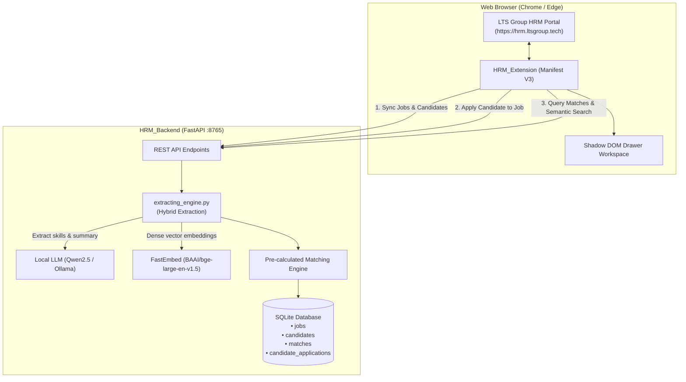

# HRM_JobMatching: Intelligent Recruitment Matching & Workflow Platform

An end-to-end local recruitment intelligence and job-matching platform designed for LTS Group HRM (`https://hrm.ltsgroup.tech/recruitment`).

The system integrates a browser extension client (`HRM_Extension`) with a high-performance local AI backend (`HRM_Backend`) to automate candidate/job data extraction, extract skills via a hybrid regex + local LLM pipeline, compute dense vector embeddings, pre-calculate bi-directional match scores, and manage multi-job candidate applications.

---

## Sub-Projects

| Sub-Project | Tech Stack | Role & Key Responsibilities |
| --- | --- | --- |
| [**`HRM_Backend`**](HRM_Backend/README.md) | Python 3.10+, FastAPI, SQLite, FastEmbed, Ollama | Local AI extraction engine (regex baseline + local LLM enrichment), dense ONNX embeddings, calibrated cosine semantic search, bi-directional matching, and multi-job application tracking. |
| [**`HRM_Extension`**](HRM_Extension/README.md) | Chrome Manifest V3, Vanilla JS, Shadow DOM | In-page recruitment workstation with SPA navigation detection, authenticated HRM API harvesting, real-time backend synchronization, multi-job application management, and calibrated semantic search UI. |

For detailed documentation of each sub-project, see:
- [HRM_Backend README](HRM_Backend/README.md)
- [HRM_Extension README](HRM_Extension/README.md)

---

## System Architecture



---

## Candidate-Job Application Relationships & Multi-Job Support

Recruitment candidates are not tied to a single position; they can apply to multiple jobs over time:

1. **Automatic Initial Ingestion**:
   - When viewing a Job Request candidate route in HRM (`/recruitment/job-requests/candidate/<jobRequestsId>`), the extension queries HRM candidate APIs.
   - The response includes `jobRequests` representing the candidate's currently applied job and status (e.g. `PM_ROUND`, `INTERVIEW`, `OFFER`).
   - `HRM_Backend` automatically creates/updates records in `candidate_applications`, mapping the candidate to the job and inheriting the status.

2. **Multi-Job Visualization**:
   - Standalone `Status` columns have been replaced by the **`Applied Jobs`** column across all candidate tables.
   - The `Applied Jobs` column renders distinct status badges for every job the candidate has applied for.

3. **In-Drawer Job Applications**:
   - **Job Matching Candidates Table**: Includes an **`Action`** column. When the candidate is not applied yet, a **`Review`** button opens the **Candidate Review Page**; once assigned it switches to a disabled `Applied` state.
   - **Search Candidates Table & Matching Jobs List**: The selected candidate's matching jobs list includes an **`Action`** column placed next to **`Matching %`** with the same **`Review`** button, allowing recruiters to inspect a candidate against a matching position before assigning.
   - **Candidate Review Page**: A focused four-frame workspace (auto-expanded to full page):
     - *Top-left*: Job details (title, code, level, request, description, extracted skills).
     - *Bottom-left*: Extracted information from the candidate CV (contact, level, experience, summary, skills, matched experience).
     - *Top-right*: The candidate's actual CV rendered as an embedded PDF.
     - *Bottom-right*: Reviewer's comment box.
     - *Footer*: The **`Assign`** button performs the actual link via `POST /api/candidates/{candidate_id}/apply`.
   - Buttons dynamically switch to a disabled `Applied` state once assigned.

---

## Quick Start Guide

### 1. Setup & Launch HRM_Backend

```bash
cd HRM_Backend

# 1. Run setup script (installs dependencies & pulls local LLM)
./setup_backend.sh

# 2. Start the service (starts Ollama if needed and runs FastAPI on port 8765)
./run.sh
```

- API Service: `http://localhost:8765`
- Interactive API Documentation: `http://localhost:8765/docs`
- Health Check: `http://localhost:8765/api/health`

### 2. Install & Run HRM_Extension

1. Open Chrome or Edge and navigate to `chrome://extensions` (or `edge://extensions`).
2. Enable **Developer mode** in the top right.
3. Click **Load unpacked** and select the `HRM_Extension` directory.
4. Navigate to `https://hrm.ltsgroup.tech/recruitment` and log in.
5. Open any job request candidate page (e.g. `/recruitment/job-requests/candidate/<jobRequestsId>`).
6. Click the floating widget or toolbar icon to open the recruitment workspace drawer.

### 3. Running Automated Tests

Run the complete backend test suite:

```bash
cd HRM_Backend
./.venv/bin/python3 -m unittest test_backend.py
```

---

## License

Internal tooling for LTS Group HRM Recruitment Workflows.
